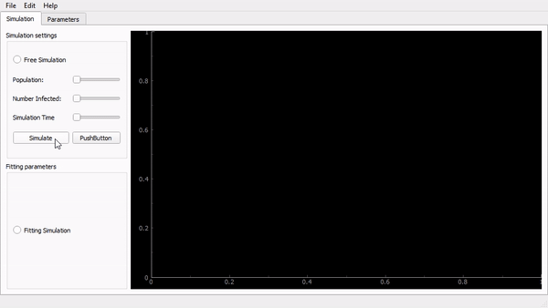

# Virus Propagation Simulator

This simulator was built during the COVID-19 erruption. The world is in chaos ahah.
Instead of looking at the brownian simulation that everyone is so optimistic about, I wanted to be sure that the curves they were showing matched the profile of a real simulation with lots of parameters. It took me a day to think about it and code it, so don't expect too much. _We are more interested in the curves it produces than in the actual numbers, since there are many parameters that aren't really precise._ **If we had numbers and studies for each parameter, that would be really cool to try it out.**

For now, the parameter file is filled with proportion of the Quebec's population age according to last 2019 surveys.

# NEW IN VERSION 0.2
- Implementation in a live graphGUI!

## JSON population's parameters file
A JSON file contains all the population information on every possible parameter. View the .json in the project to understand. Each parameter has a _mean_ and a _standard deviation_ from which we will later distribute randomly those parameters according to a gaussian curve with the same _mean_ and _sd_.

## Person class

A `Person`encapsulate all the following parameters:

    'knownEncounteredPerDay': 
    'unwantedEncounteredPerDay':
    'probabilityOfInfection'
    'timeBeforeInfectious'
    'timeOfIncubation'
    'timeOfPeakSymptoms'
    'probabilityOfDying'
    'timeOfRecuperation'
    'timeBeforeNonInfectious'
    'willQuarantine'

All those parameters are decided in the `VirusSimulator` class. They are distributed according to the gaussian curve generated with the _mean_ and _sd_ in the .json.

and a `Person` encapsulates all the following states:
        
      self.listOfRelatives = []
      self.timeSinceInfection = 0
      self.isReachable = 1
      self.needsMedicalAttention = 0
      self.isHospitalised = 0
      self.isAlive = 1
      self.isInfected = 0
      self.isInfectious = 0
      self.hasSymptoms = 0
      self.isRecovered = 0
 
Which are changed and monitored throughout the simulation for each individual.

## VirusSimulator class

Each function does complex things. The important function to use si the `simulate` function.
`simulate(nbOfPeople, amountOfTime, parametersOfPopulation)`. Those are the 3 parameters to launch a simulation. The other parameters to be changed are in the .json. 

This simulation will start by creating the population. `create_population`. This give random gaussian parameters and creates X number of individuals all stored in a list. You end up with a `list` of `Person` objects.

Then, `initialize_infection(nbOfPeople)` randomly infects `nbOfPeople` number of people.

Then, `launch_propagation` happens. I'm not sure I'm up to explain all of it.

- Results: All the information of the simulation is stored in `self.statusByAgeGroup`. It is a `dict` with tracking on each of the `Person` states, divided in groups of age. So, for every simulation day, you have a new dictionnary within the dictionnary.

## How to Simulate

Here is a code snippet:

    import matplotlib.pyplot as plt
    import json
    from VirusSimulator import VirusSimulator

    with open("params.json") as f:
      parametersFile = json.load(f)

    COVID19 = VirusSimulator()
    COVID19.simulate(80000, 60, parametersFile[0])
    print(COVID19.statusByAgeGroup)
    
    fig, ax1 = plt.subplots(figsize=(4, 4))

    wantedStatus = 'isInfected'
    xdata = range(len(COVID19.statusByAgeGroup))

    for ageKey in COVID19.statusByAgeGroup[0].keys():
        data2plot = []
        for dayKey in COVID19.statusByAgeGroup.keys():
            data2plot.append(COVID19.statusByAgeGroup[int(dayKey)][ageKey][wantedStatus])
        ax1.plot(xdata, data2plot, label=ageKey)

    ax1.legend()
    plt.show()

## Next to implement

**All the following parameters should follow a gaussain curve**

- A will the self isolate after the apparition of symptons (parameter's there but not implemented)
- The death of people (parameter's there but not implemented)
- A severity index parameter
- The need for medical attention, orelse the chance of dying increases by a factor
- A maximum medical care capacity
- A number of unwanted encourters (door knob, buttons, tables, etc.)
- More.

